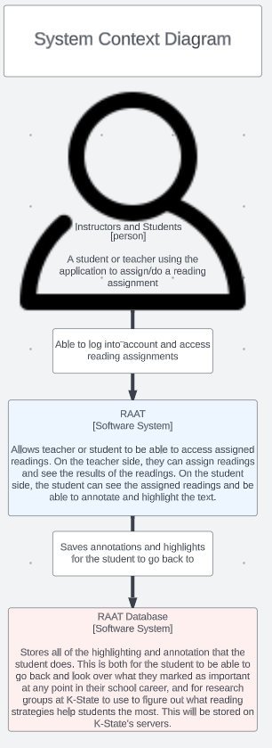
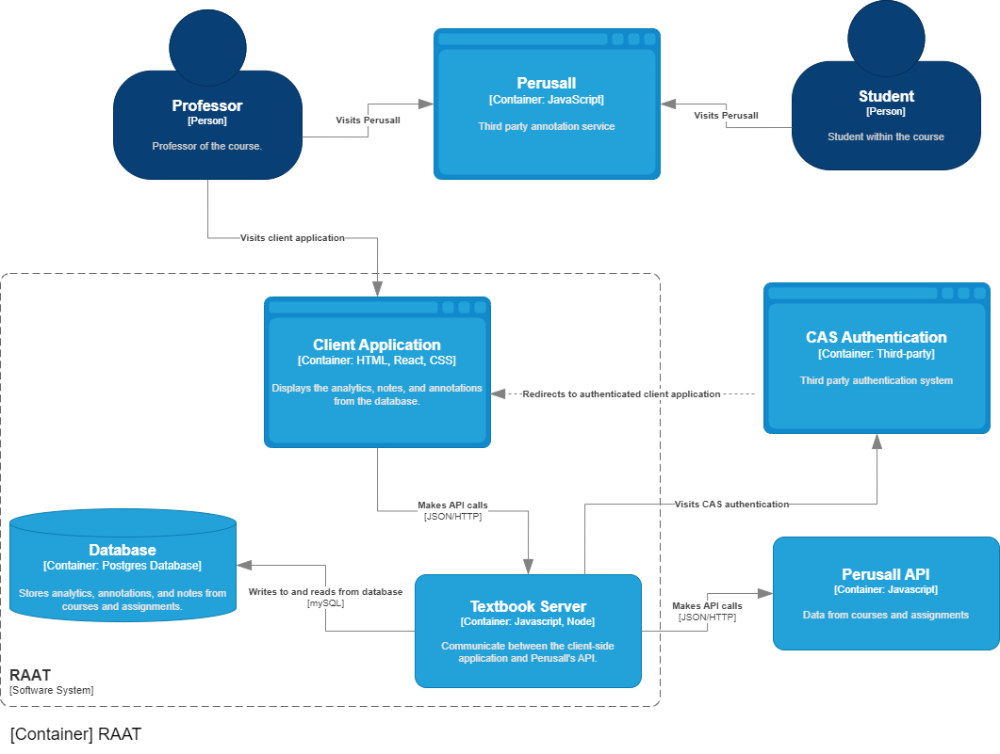
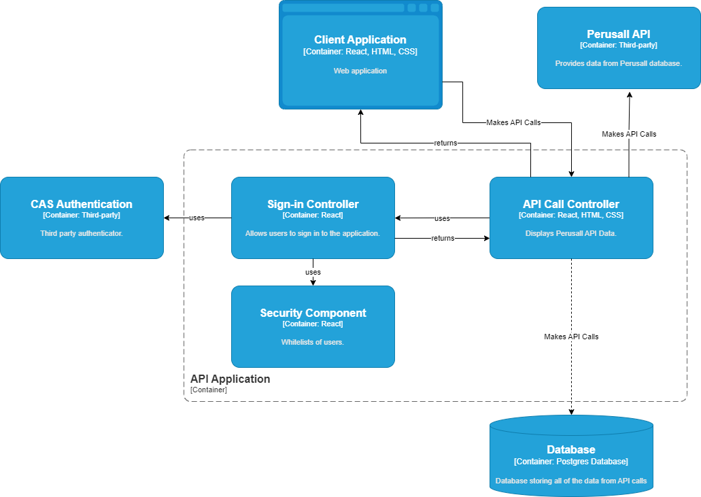

## Specification Doc Intro Section: 
### Broad Overview:
This application helps instructors, teachers, and professors ensure that students read and understand concepts while allowing students to annotate and ask questions on assigned readings. All the while, storing this information so that scholars and researchers can look and utilize said information.  This application will allow for Computer Science students at K-State to have assigned readings that allows them to read textbooks, or watch videos, and be able to annotate and give notes on the material through Perusall. Furthermore, the professor of the students will be able to view the annotations, notes, and analytics of individual students and on a class level.  

# Project Overview 
General factors that are affecting this product and its requirements are that it is being designed as a tool for helping students better comprehend material given by their teacher/instructor, while also being designed for K-State University use. This application helps instructors, teachers, and professors ensure that students read and understand concepts while allowing students to annotate and ask questions on assigned readings. This grants students the ability to ask questions when they have trouble understanding some parts of the assigned reading and grants other students answers to similar questions. The biggest constraint we are facing is understanding our use cases for developing the application.

## Current Features

- Get data from Perusall API.

- Store data in Postgres database.

- Displays data on webpages from API and database.

## Future Features: 

 - Database stored at K-State to save information on how students performed in their classes.

 - Application aggregates data

 - [ToDo List](ProjectToDo.md)
 
## General Stakeholders

 - Teacher/Professor
 - Students
 - University due to potential licensing
 
## Specific Stakeholders
 - Russel Feldhausen
 - Nathan Bean

## Persona of Professor Jack
- Age: 32
- Location: Manhattan, KS
- Education: Masters in Computer Science
- Job-Title: Assistant Professor
- Goals:
  * Research time interactivity among students on class readings
  * Understand the interactions the students have with the readings
    * Time actively engaged with assignment
    * What pages were looked at the most

 
# Development and Target Environments

The physical environments that our application will be used in are at a university level. It will interface in some way with a server hosted on campus in order to store information and data on assigned readings.  

## Tech Stack
 - React/JavaScript
 - CSS
 - HTML
 
# System Model

### Context diagram:

### Container diagram:

### Component diagram:

# User Interaction

 - Users can query a database hosted on K-State's servers to be able to get information about a specific student or class.

 - Users can manually request an update of the database instead of waiting for the automatic run.
 
# Functional Requirements

- Database needs to be hosted on K-State or secure servers.

- A script will need to be automatically run to start the application at a predetermined time.

- The application will collect information from the API endpoints of Perusall.
 
# Nonfunctional Requirements

 - The application shall run as quickly and as efficiently as possibile to avoid being stopped by other processes.

 - The application shall ensure that as little information is requested through the API to avoid extra charges and bandwidth from duplicate API calls.

 - The application shall securely store data to the database without any errors or loss of data. 
 
# Semester Goals

### Minimum viable product 
- The system sends and retrieves information from Perusall and saves data about assignments to a database. While allowing users to complete Perusall assigned readings.

### Enhanced Version
- Along with the minimal requirements, the application will allow professors to query the database and apply sorting to the recieved information.

# Appendices
### Database Diagram

[Database diagram](DatabaseDiagram.drawio(1).pdf)
