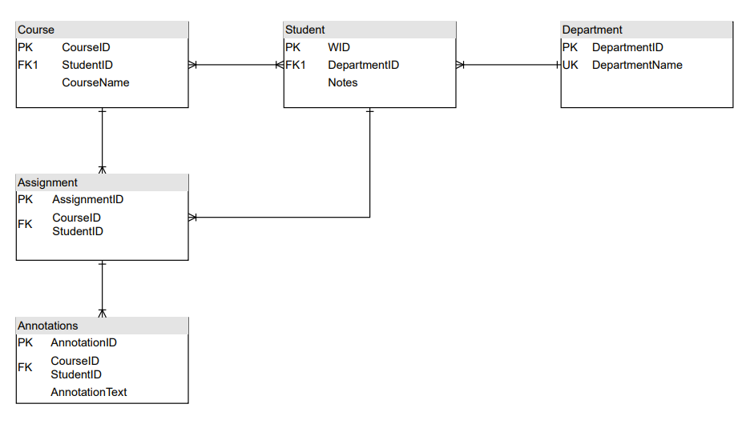

## Specification Doc Intro Section: 
### Broad Overview:
This application helps instructors, teachers, and professors ensure that students read and understand concepts while allowing students to annotate and ask questions on assigned readings. All the while, storing this information so that scholars and researchers can look and utilize said information.  This application will allow for Computer Science students at K-State to have assigned readings that allows them to read textbooks, or watch videos, and be able to annotate and give notes on the material through Perusall. Furthermore, the professor of the students will be able to view the annotations, notes, and analytics of individual students and on a class level.  

# Project Overview 
General factors that are affecting this product and its requirements are that it is being designed as a tool for helping students better comprehend material given by their teacher/instructor, while also being designed for K-State University use. This application helps instructors, teachers, and professors ensure that students read and understand concepts while allowing students to annotate and ask questions on assigned readings. This grants students the ability to ask questions when they have trouble understanding some parts of the assigned reading and grants other students answers to similar questions. The biggest constraint we are facing is understanding our use cases for developing the application, and devising the API calls to our outside sources. 

## List of Features: 
 - Provides a service to help assign reading to students and allows the students to make annotations on the assigned reading. 

 - Allows the student to be able to go back and see previous annotations and highlights from previous classes even after their class ends. 

 - App interfaces with Perusall, then Perusall communicates with canvas and Perusall will pass back grades to canvas to set the grade for the assigned reading 

 - Professor can set URLs for reading assignments with Perusall and can set reading to only cover certain pages. 

 - Database back-end stored at K-State to save what the students highlighted and annotated, to be used in research on how students who did well studied 

 - Application after interfacing with Perusall allows for gathering data from Perusall’s API. 
 
## General Stakeholders

 - Teacher/Professor
 - Students
 - University due to potential licensing
 
## Specific Stakeholders
 - Russel Feldhausen
 - Nathan Bean
 
# Development and Target Environments

The physical environments that our application will be used in are at a university level. It will interface in some way with a server hosted on campus in order to store information and data on assigned readings.  

## Tech Stack
 - React/JavaScript
 - CSS
 - HTML
 
# System Model

### Context diagram:

### Container diagram:

### Component diagram:

# User Interaction

 - When the user clicks the button to load another tool on a separate page in Canvas they get sent to a K-state login page. 

- They input their information and click the login button or press enter. 

- They are then shown their assigned readings or watching’s and they then select one of their assigned readings. 

 - They are shown the assignment and then the user does any number of his assigned readings or watching's. 

 - After finishing for now they then either click X on the web page or press the logout button. 

 - If they press the X they return to Canvas. 

 - If they press the logout button they are logged out and sent back to the login screen before clicking X.
 
# Functional Requirements

The Application runs in the user’s web browser and provides the user the ability to see currently assigned readings or viewings and allows the user to annotate and view the assigned content. 

 - The application must first send the user to authenticate using a CAS server. 

 - The Perusall section of the application must allow verified users to see all assigned assignments to them. 

 - The Perusall section of the application must allow verified users to annotate and interact with all assigned assignments. 

 - The application must allow verified users to log out of the CAS server and be sent back to the CAS login screen. 

 - The application must store assignment statistics data to a database. 
 
# Nonfunctional Requirements

 - When the enter button is pressed, the system must display the result and load the content within 3 seconds. 

 - The assignments shall be populated and contain the assignment content. 

 - The annotations shall be shown to all others on the assignment within 3 seconds.  

 - When the logout button is pressed, they shall be sent back to the CAS login screen within 2 seconds. 

 - The application shall securely store data to the database without any errors or loss of data. 
 
# Semester Goals

### Minimum viable product 
- Communication between our application and Perusall via Json files. 

### Enhanced Version
- The system sends and retrieves information from Perusall and saves data about assignments to a database. While allowing users to complete Perusall assigned readings.

# Appendices
### Database Diagram

